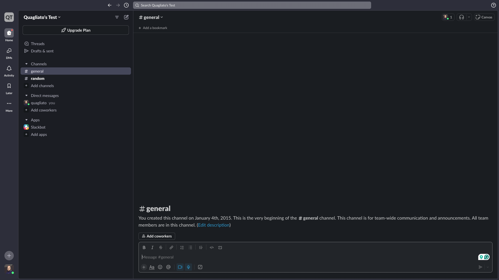

# Dracula for [Slack](http://slack.com)

> A dark theme for [Slack](http://slack.com).

## Install

All instructions can be found at [draculatheme.com/slack](https://draculatheme.com/slack).

## Team

This theme is maintained by the following person(s) and a bunch of [awesome contributors](https://github.com/dracula/slack/graphs/contributors).

|  |  |  |
|---------------------------------------------------------------------------------------------------------|----------------------------------------------------------------------------------------------------------------|------------------------------------------------------------------------------------------------------------|
| [Trevor Heins](https://github.com/heinst)                                                               | [Eduardo Quagliato](https://github.com/quagliato)                                                              | [Mathieu Lapierre](https://github.com/taka0o)                                                              |

## Community

- [Twitter](https://twitter.com/draculatheme) - Best for getting updates about themes and new stuff.
- [GitHub](https://github.com/dracula/dracula-theme/discussions) - Best for asking questions and discussing issues.
- [Discord](https://draculatheme.com/discord-invite) - Best for hanging out with the community.

## License

[MIT License](./LICENSE)
